# Fontdue

A delicious way to explore and compare typefaces.

Fontdue is a browser-based typography preview tool that lets you see how fonts look across various real-world UI layouts. Browse fonts from Google Fonts, Bunny Fonts, and Fontshare, then preview them instantly in forms, cards, dashboards, and more.



## Features

- **Font Browser** — Browse curated collections from Google Fonts, Bunny Fonts (GDPR-friendly), and Fontshare
- **One-Click Add** — Add fonts to your collection with a single click
- **20+ Layout Previews** — See fonts in realistic contexts: login forms, pricing cards, dashboards, articles, and more
- **Live Preview** — Instantly see how any font looks across all layouts
- **Keyboard Navigation** — Use arrow keys to quickly cycle through fonts
- **Theme Support** — Multiple color themes with light/dark mode
- **Local Storage** — Your font collection persists in your browser
- **No Build Required** — Pure HTML, CSS, and vanilla JavaScript

## Quick Start

1. Clone the repository:
   ```bash
   git clone https://github.com/daveonkels/fontdue.git
   cd fontdue
   ```

2. Serve the files with any static server:
   ```bash
   # Using Python
   python3 -m http.server 8000

   # Using Node.js
   npx serve

   # Using PHP
   php -S localhost:8000
   ```

3. Open `http://localhost:8000` in your browser

That's it! No npm install, no build step.

> **Note:** Fontdue must be served via a local web server (http://localhost). Opening `index.html` directly in your browser (file://) won't work because browsers block fetch requests and ES modules from file:// URLs for security reasons.

## Usage

### Browsing Fonts

Click **Add Font** to open the font browser. You'll see three tabs:

- **Google Fonts** — 100 popular fonts from Google's collection
- **Bunny Fonts** — GDPR-friendly alternative (fonts served from EU)
- **Fontshare** — 50 premium free fonts from Indian Type Foundry

Click the **+** button on any font card to add it to your collection.

### Loading Full Catalogs

The curated collections work without any API keys. To load the complete Google Fonts catalog (1600+ fonts):

1. Get a free API key from [Google Cloud Console](https://console.cloud.google.com/apis/credentials)
2. Enable the "Google Fonts Developer API"
3. Click "Load Full Catalog" in the Google Fonts tab
4. Enter your API key when prompted

Bunny Fonts full catalog loads without an API key.

### Keyboard Shortcuts

| Key | Action |
|-----|--------|
| `↑` / `↓` | Cycle through fonts |
| `⌘K` / `Ctrl+K` | Focus search |
| `Esc` | Close modals |

### Adding Custom Fonts

Click the **+ Manual** tab in the font browser to add:

- **Google Fonts** — Enter any font name from fonts.google.com
- **Fontshare** — Enter any font name from fontshare.com
- **CDN URL** — Any CSS stylesheet URL
- **Local System Fonts** — Fonts installed on your computer (Chrome/Edge only)
- **Upload** — .woff2, .woff, .otf, or .ttf files

## Project Structure

```
fontdue/
├── index.html          # Main HTML file
├── css/
│   ├── base.css        # CSS variables, themes, reset
│   ├── controls.css    # UI components, modals, sidebar
│   └── layouts.css     # Preview layout styles
├── js/
│   ├── main.js         # App initialization
│   ├── fontManager.js  # Font collection state
│   ├── fontLoader.js   # Font loading utilities
│   ├── fontCatalog.js  # Catalog management
│   ├── fontBrowser.js  # Font browser modal
│   ├── layoutEngine.js # Preview layout generation
│   ├── themeManager.js # Theme/dark mode handling
│   └── ui.js           # Sidebar and UI interactions
├── data/
│   └── catalogs/       # Curated font catalogs (JSON)
└── assets/
    ├── logo.svg        # App logo
    ├── favicon.svg     # Browser favicon
    └── uploads/        # User-uploaded fonts (gitignored)
```

## Font Sources

| Source | Fonts | API Key | Notes |
|--------|-------|---------|-------|
| Google Fonts | 100 curated / 1600+ full | Optional (for full catalog) | Most popular web fonts |
| Bunny Fonts | 97 curated / 150+ full | Not required | GDPR-friendly, EU-hosted |
| Fontshare | 50 curated | Not required | Premium quality, free for commercial use |

## Browser Support

Fontdue works in all modern browsers:

- Chrome/Edge 88+
- Firefox 78+
- Safari 14+

The Local Font Access feature (for system fonts) requires Chrome or Edge.

## Themes

Fontdue includes 8 color themes:

- Terracotta (default)
- Ocean
- Forest
- Lavender
- Midnight
- Sunrise
- Slate
- Ember

Each theme supports both light and dark modes.

## Data Storage

All data is stored in your browser's localStorage:

- `fontdue-fonts` — Your font collection
- `fontdue-settings` — App settings (theme, Google API key if provided)

No data is sent to any server. Your font collection stays private.

## Contributing

Contributions are welcome! Feel free to:

- Add new preview layouts
- Improve existing layouts
- Add new font sources
- Fix bugs
- Improve documentation

## License

MIT License — see [LICENSE](LICENSE) for details.

## Acknowledgments

- [Google Fonts](https://fonts.google.com) for their amazing font library
- [Bunny Fonts](https://fonts.bunny.net) for the privacy-friendly alternative
- [Fontshare](https://www.fontshare.com) by Indian Type Foundry for beautiful free fonts

---

Made with care for typography enthusiasts.
